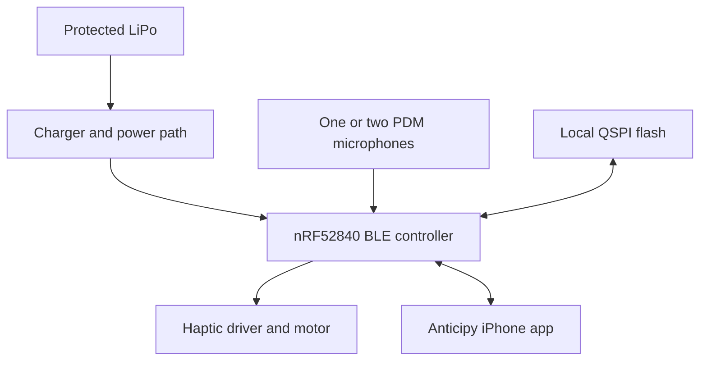

# Anticipy hardware system map

## Current product target

The September 4 brief targets at least 16 hours of battery life and local compressed-audio storage, with 20 hours of storage margin. The engineer must validate the architecture, exact parts, current draw, BLE protocol, storage math, RF plan and complete enclosure stack before PCB or CNC release.

## Existing XIAO prototype reference

The XIAO version is a proof path, not the final custom PCB. It uses the XIAO nRF52840 Sense microphone and streams live audio to the iPhone. The no-Lee's reference haptic circuit is:

| From | To |
|---|---|
| XIAO D0 | 100 ohm resistor, then AO3400A/equivalent N-MOSFET gate |
| MOSFET gate | 100 kohm resistor, then GND |
| MOSFET source | XIAO GND |
| MOSFET drain | Motor negative |
| XIAO 3V3 | Motor positive |
| Flyback diode cathode/stripe | Motor positive / 3V3 |
| Flyback diode anode | Motor negative / MOSFET drain |

Never connect the motor directly to D0. The battery, motor, driver and closed enclosure still require real measurements and release testing.

## Existing custom-PCB R0B checkpoint

- 45.8 x 18.0 mm, four-layer, nominal 0.80 mm PCB.
- Editable KiCad 7-era schematic and PCB files are included.
- 70 electrical references and 223 source-of-truth pins were checked in the handoff.
- PCB geometry DRC reported zero geometry violations, but **176 electrical connections remain unrouted**.
- The battery, final enclosure, production firmware, fab stack-up and final component-height STEP are unresolved.

The R0B source is suitable for a senior PCB engineer to continue, not for direct fabrication.
