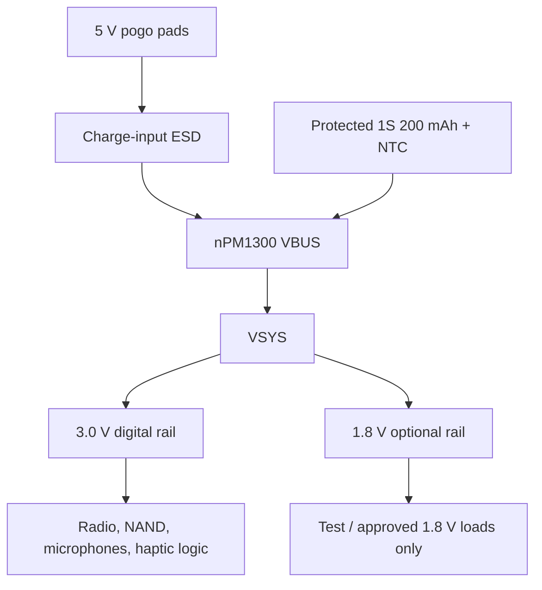

# Power and signal architecture

## Power tree

The two buck outputs are separate. `3V0` is the digital rail because the approved 4-Gbit NAND is a 3 V device. `1V8` is never tied to `3V0`.

## Primary net groups

| Group | Nets | Board state |
|---|---|---|
| Charge/battery | `CHG_5V`, `VBUS`, `VBAT`, `BAT_NTC`, `VSYS`, `GND` | Named and padded; source/pack gates remain |
| Regulators | `SW_BUCK1`, `1V8`, `SW_BUCK2`, `3V0`, `VSET1`, `VSET2` | nPM pin map and reference inductors established |
| NAND | `FLASH_VDD`, `QSPI_CS/CLK/IO0..3_TO_U1_PAD_TBD` | Peripheral pins verified; radio endpoints gated |
| PDM audio | `MIC_A_VDD`, `MIC_B_VDD`, `PDM_CLK/DATA_TO_U1_PAD_TBD` | Shared-bus two-mic topology; separate power isolation |
| Haptic | `HAPTIC_SDA/SCL/EN_TO_U1_PAD_TBD`, `HAPTIC_OUT_P/M` | Driver mapped; selected JYC720FDRL is off-board; J3 hot-bar land and radio endpoints gated |
| RF | `RF_FEED_TO_U1_PAD_TBD`, `RF_MATCH_A/B` | Tune footprints and antenna present; radio pad and tuning gated |
| Debug/control | `SWDIO`, `SWCLK`, `RESET`, `UART_TX/RX`, button, LED | Named test pads; radio/button pad maps gated |

## Storage capacity contract

The NAND is 4 Gbit = 512 MiB raw. The recorder may budget no more than 480 MB before physical validation. At 5,000 bytes/s, 20 hours plus a 15% reserve requires:

`5,000 × 72,000 × 1.15 = 414,000,000 bytes`

The PCB only provides the storage device and debug isolation. Firmware must still prove ECC, factory/runtime bad-block handling, power-fail-safe commits, wear management and recovery.
