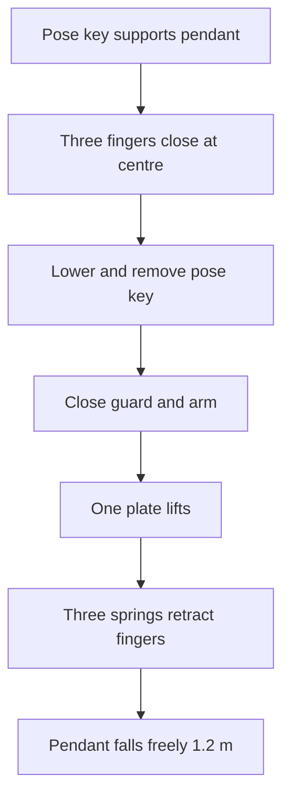

# Anticipy low-cost QA fixtures

These files build two **screening tools**, not certification machines:

1. **Rattle cradle:** slowly reverses a sealed 51 x 21 x 11 mm pendant about its own centre while a removable contact sensor listens for internal clicks.
2. **Drop release:** holds a pendant in one of 26 documented orientations at 1.2 m, then retracts three fingers from one common latch so the pendant enters a true free fall.

The important idea is simple: the rattle fixture never bangs the product, and the drop stand never guides the falling product. The mast guides only the release head.

## Status

- 42 STL files are generated: 16 fixture/dummy parts and 26 orientation keys.
- Every STL is watertight, outward-wound, one connected body, positive volume, free of degenerate faces and within the Bambu P2S build volume according to `reports/mesh_verification.json`.
- STEP files are provided for every printed part plus closed/released assembly views.
- Geometry verification does **not** prove physical strength, release timing, acoustic accuracy or low-spin performance. Those gates are measured on the built fixture with the inert dummy.

## Start here

1. Read `SAFETY.md`.
2. Open `BOM.csv` and obtain the bought hardware.
3. Run:

   ```bash
   python3 generate_fixtures.py
   python3 verify_meshes.py
   python3 validate_package.py
   ```

4. Print PETG parts using `PRINT_SETTINGS.md`; print only the two named cassette liners in TPU 95A.
5. Build the cradle with `ASSEMBLY_RATTLE.md`.
6. Build and validate the drop release with `ASSEMBLY_DROP.md`.
7. Use `acceptance_test_template.csv` with `qa_acceptance.py` for every fixture qualification and DUT run.

## What each generated part does

| File family | Quantity to print | Purpose |
|---|---:|---|
| `rattle_cassette_base/lid` | 1 each | Hard cassette with central contact-sensor window |
| `rattle_cassette_liner_*` | 1 each, TPU | Controlled soft contact around the DUT |
| `rattle_rotor_disk` | 1 | Connects cassette to purchased 8 mm clamping hub |
| `rattle_edge_axis_adapter` | 1 | Turns cassette 90 degrees; two patterns cover the other two axes |
| `rattle_608_bearing_tower` | 2 | Supports the 8 mm rotor shaft |
| `rattle_nema17_mount` | 1 | Holds the belt-driven stepper away from the cassette |
| `rattle_base_plate` | 1 | Printable base or drill template for plywood |
| `drop_collet_body` | 1 | Horizontal free-fall opening and three guide supports |
| `drop_finger_guide` | 3 | Captures each spring-open radial finger |
| `drop_radial_finger` | 3 | Carries adjustable nylon/PTFE contact tip |
| `drop_common_latch_plate` | 1 | One lifted plate releases all three fingers |
| `drop_three_cord_lift_yoke` | 1 | Keeps the three latch-lift cords symmetric at one solenoid |
| `drop_pose_key_01...26` | 1 set | Holds the desired face, edge or corner during setup only |
| `*_inert_*_dummy` | 1 | Battery-free release and acoustic challenge dummy |

## Release motion



Before the first live-device drop, complete 30 inert-dummy releases. At 240 fps, all three fingers must clear, no part may touch the dummy after release, and angular change over the first 0.5 m must be no more than 5 degrees.

## Directory map

- `stl/`: print-ready meshes in millimetres
- `step/`: editable solids and assembly views
- `firmware/rattle_cradle_controller/rattle_cradle_controller.ino`: guarded cradle controller
- `firmware/drop_release_controller/drop_release_controller.ino`: one-pulse guarded release controller
- `rattle_audio_score.py`: compares a DUT WAV recording with qualified golden recordings
- `qa_acceptance.py`: evaluates a completed acceptance CSV
- `drop_orientation_map.csv`: the complete 26-drop sequence
- `reports/fixture_manifest.json`: dimensions and volume of every generated part
- `reports/mesh_verification.json`: mesh checks and hashes
- `reports/release_validation.md`: digital package verification and remaining physical gates
- `BUILD_MANIFEST.sha256`: release-file integrity hashes

## What this package intentionally does not do

- It does not short, crush, puncture, heat, overcharge or otherwise abuse a lithium battery.
- It does not replace IEC 60068, IEC 60529, IEC 62133-2, UN 38.3, ISTA or an accredited laboratory.
- It does not authorize recharging a dropped or mechanically damaged battery.
- It does not promise a spin-free release until the physical dummy-video gate passes.
