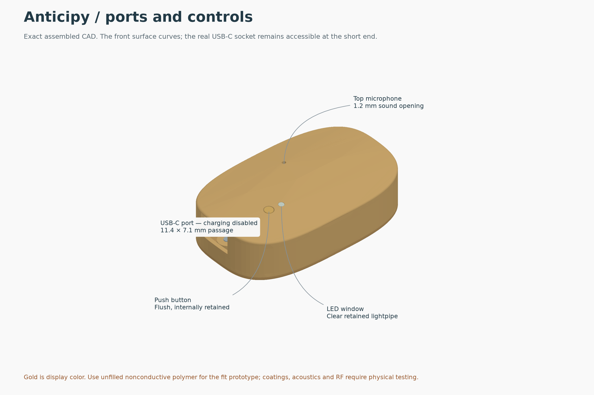
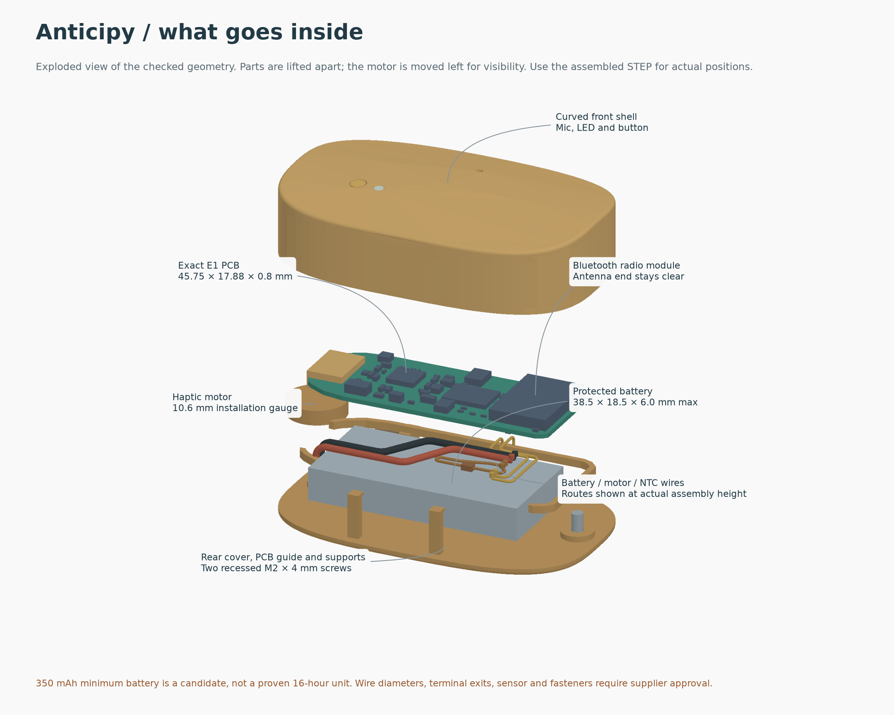

# Latest Anticipy builds

This folder contains the current **E1P1 custom PCB and matching oval case**, released on 9 September 2026. Start here for the most recent engineering files. The full `E1P1/` handoff is identical to the checked package emailed to Omar; earlier hardware generations remain elsewhere in the repository.

**[Download the complete PCB + CAD + parts handoff](Anticipy_E1P1_Boston_Handoff_2026-09-09.zip)** — download the ZIP using GitHub's Download raw file button, then extract it before opening KiCad. Required libraries and 3D models are included.

| What you need | Current file |
|---|---|
| KiCad project | [Open project](E1P1/pcb/electrical/Anticipy_R1_E1_PROTOTYPE.kicad_pro) |
| Actual routed PCB | [Native PCB](E1P1/pcb/electrical/Anticipy_R1_E1_PROTOTYPE.kicad_pcb) |
| Native schematic | [Schematic](E1P1/pcb/electrical/Anticipy_R1_E1_PROTOTYPE.kicad_sch) |
| Circuit, assembly and copper-layer drawings | [Fabrication and assembly PDF](E1P1/E1P1_Fabrication_and_Assembly.pdf) |
| Gerbers, drills, placements and BOM | [Manufacturing files](E1P1/pcb/manufacturing/) |
| Actual assembled 3D model | [Assembled STEP](E1P1/cad/Oval_E1_Assembly_FIT_CANDIDATE.step) |
| Printable shell, rear cover, button and lightpipe | [CAD files and build instructions](E1P1/cad/Mechanical_Handoff.md) |
| Three opaque print pieces in one file | [Geometry-only 3MF](E1P1/cad/Oval_E1_Three_Print_Parts_GEOMETRY_ONLY.3mf) |
| What to buy and what was already purchased | [Readable checklist](E1P1/procurement/Missing_Parts.md) · [Exact CSV](E1P1/procurement/Missing_Parts.csv) |
| Manufacturers and Boston delivery plan | [Supplier call sheet and logistics](E1P1/logistics/Manufacturing_Saturday_Plan.md) |
| Supplied first-power firmware | [Programming image and instructions](E1P1/programming/) |
| Matching firmware source, board definitions and build recipe | [Bench firmware source](firmware_source/README.md) |
| Verification and remaining work | [Handoff README](E1P1/README.md) · [Release status](E1P1/RELEASE_STATUS.json) |

The PCB is **45.75 × 17.88 × 0.8 mm**. Its matching case is **56 × 35 × 14.8 mm**. This release does **not** meet the requested 30 × 14 × 8 mm product envelope. Gold in the render is display color; the case material must be nonconductive and physically tested.

The saved PCB passed the recorded native DRC/ERC and connectivity checks. The matching CAD passed 2,826 geometry checks. These are engineering checks, not proof of working physical units. **Charging is disabled in the supplied bench firmware; complete offline recording/recovery/backfill and physical wearable qualification remain unfinished.** Supplier stock and the September 12 delivery plan are timestamped research, not current reservations or a guaranteed shipment.

For fabrication use the final BOM and process specification: all 137 vias require epoxy filling, planarization and copper capping. Do not substitute an ordinary tented-via fabrication tier. Use the assembled STEP for coordinates; the exploded STEP is for viewing only.

[Retained component evidence](reference_evidence/) supplies the comparison documents omitted from the email ZIP. Some original receipts retain historical local build paths. The canonical component decisions are [here](E1P1/pcb/verification/Component_Release_Decisions.json); the duplicate under `engineering_decisions/` preserves earlier analysis.

The PCB SHA-256 is `78fe28acde6ceb3ab33aac8af503d4c418540cce31979cc91d3add5e5d0bec36`. The archive SHA-256 is `4698b9c9e017caaaf4426d47813afc3f3b23f76035c57b41cd91886f18ee0e7a`. The [handoff manifest](E1P1/HANDOFF_MANIFEST.json) and [checksums](E1P1/SHA256SUMS) identify the exact release files. Run `shasum -a 256 -c SHA256SUMS` from `E1P1/` after downloading.

The matching firmware source is included separately in `firmware_source/`. Its 253 application files match the recorded source behind the supplied HEX. It is not part of the original handoff ZIP; download that directory or clone the repository to rebuild. The SDK/toolchain are external dependencies. [Full latest-build manifest](LATEST_BUILD_MANIFEST.json).
